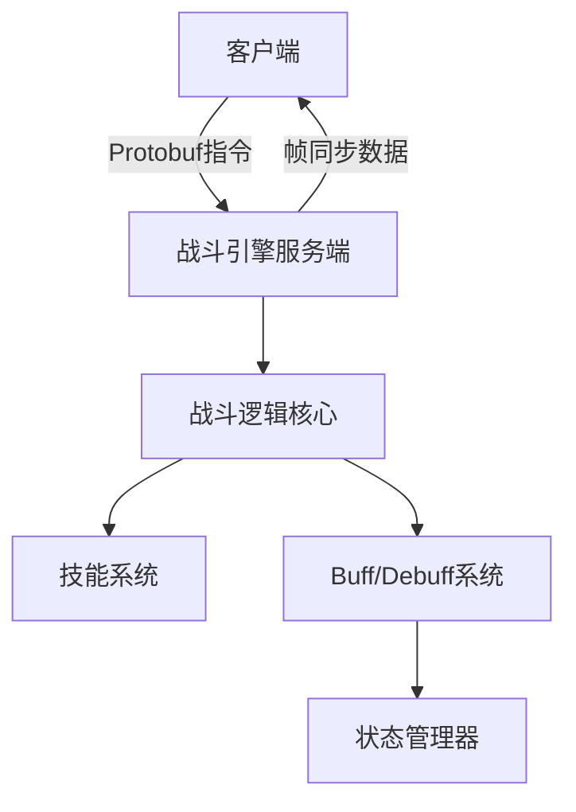

# 复杂战斗引擎设计方案

## 1. 核心架构

## 2. 功能模块

### 2.1 基础战斗系统
- 回合制/即时制切换支持
- 基于帧同步的确定性计算(10fps)
- 多单位协同战斗(最多5v5)
- 属性计算(攻击/防御/暴击等)

### 2.2 高级战斗特性
- 连招系统(技能组合触发特殊效果)
- 属性克制(火>草>水>火循环)
- 环境交互(地形影响战斗效果)
- 仇恨值管理系统

### 2.3 技能系统(三层架构)

#### 1. 技能定义层(开发)
- **职责**：基础技能逻辑实现
- **内容**：
  - 技能效果类型定义
  - 技能触发机制
  - 技能基础逻辑框架

#### 2. 系数配置层(策划)
- **职责**：数值平衡和效果调整
- **内容**：
  - 伤害系数配置
  - 效果参数调整
  - 技能等级成长曲线
  - 资源消耗公式

#### 3. 战斗属性层(运行时)
- **职责**：实时战斗效果计算
- **内容**：
  - 战场环境因素影响
  - 实时属性加成计算
  - 效果实际作用值
  - 战斗状态同步

### 2.4 技能效果链
- **与三层架构的关系**：横跨三层架构的效果执行管道
- **核心功能**：
  - 分层效果处理(定义→配置→运行时)
  - 效果优先级管理
  - 效果冲突解决
  - 战斗结果预测

### 2.4 状态系统
- 多层buff/debuff叠加
- 状态免疫和抵抗
- 状态持续时间管理
- 状态效果冲突解决

## 3. 技术实现

### 3.1 网络同步方案
| 技术 | 说明 |
|------|------|
| 帧同步 | 10fps逻辑帧率 |
| 状态快照 | 关键帧全量同步 |
| 客户端预测 | 移动和简单技能 |
| 服务器回滚 | 指令验证和修正 |

### 3.2 性能优化
- 四叉树空间分区
- ECS架构管理战斗实体
- 基于JobSystem的并行计算
- 对象池重用

## 4. 开发计划

### 阶段1: 核心框架 (2周)
- 网络通信基础
- 指令系统和帧同步
- 基础战斗循环

### 阶段2: 战斗逻辑 (3周)
- 属性计算公式
- 技能基础框架
- 伤害计算系统

### 阶段3: 高级特性 (2周)
- 连招系统
- 属性克制
- 环境交互

### 阶段4: AI系统 (2周)
- 行为树配置
- 决策逻辑
- 技能释放策略

### 阶段5: 工具开发 (1周)
- 战斗回放分析
- 网络延迟模拟
- 状态校验工具

### 阶段6: 测试优化 (2周)
- 平衡性调整
- 性能优化
- 压力测试

## 5. 风险控制
1. 网络延迟问题：增加客户端预测和插值
2. 技能复杂度：采用效果链设计模式
3. AI性能：使用行为树缓存和优先级剪枝