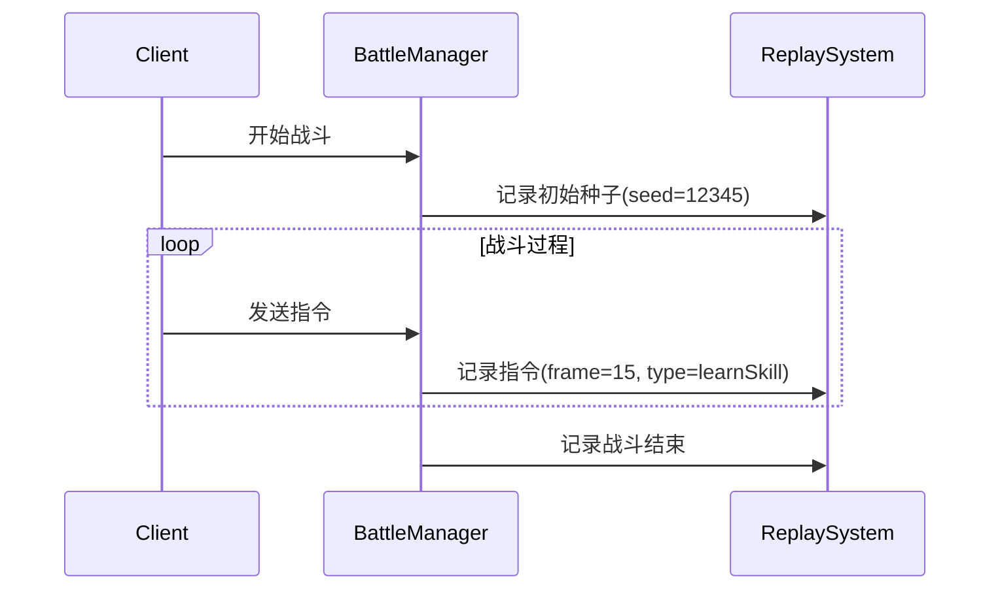

# 战斗回放系统设计文档

## 设计原理
基于伪随机特性的轻量级回放系统，通过记录随机种子和玩家指令实现战斗重现。

## 核心数据结构
```typescript
interface BattleReplayData {
  // 唯一标识
  replayId: string;
  
  // 随机种子(关键)
  randomSeed: number;
  
  // 初始战斗参数
  initParams: BattleInitParams;
  
  // 指令序列
  commands: {
    frame: number;      // 生效帧号(每秒10帧)
    playerId: string;   // 玩家ID
    type: 'learnSkill' | 'changePosition'; // 指令类型
    data: any;          // 指令数据
  }[];
  
  // 元数据
  metadata: {
    battleDuration: number; // 战斗时长(ms)
    chapter: number;     // 章节
    stage: number;       // 关卡
    players: string[];   // 玩家列表
  };
}
```

## 实现流程

### 记录阶段
1. 战斗开始时保存随机种子
2. 监听并序列化所有玩家指令
3. 记录战斗结束时间



### 回放阶段
1. 使用原始种子初始化随机数生成器
2. 按帧顺序重放指令
3. 完全重现战斗过程

## 存储优化
1. 使用二进制格式存储
2. 平均每场战斗数据 <1KB
3. 支持云端存储和分享

## 接口设计
```typescript
class ReplaySystem {
  // 开始记录
  startRecording(seed: number, initParams: BattleInitParams): void;
  
  // 记录指令
  recordCommand(frame: number, playerId: string, type: string, data: any): void;
  
  // 保存回放
  saveReplay(): Promise<BattleReplayData>;
  
  // 加载回放
  loadReplay(data: BattleReplayData): void;
  
  // 开始回放
  startReplay(speed: number = 1): void;
}
```

## 注意事项
1. 必须保证游戏逻辑完全确定性
2. 所有随机数必须使用统一种子生成
3. 禁止在战斗逻辑中使用Math.random()